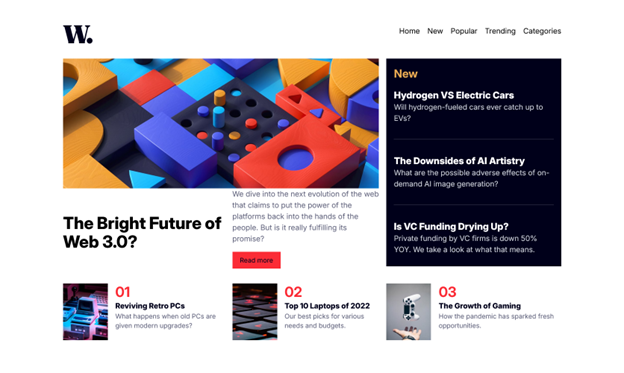

# Frontend Mentor - News homepage solution

This is a solution to the [News homepage challenge on Frontend Mentor](https://www.frontendmentor.io/challenges/news-homepage-H6SWTa1MFl). Frontend Mentor challenges help you improve your coding skills by building realistic projects. 

## Table of contents

- [Overview](#overview)
  - [The challenge](#the-challenge)
  - [Screenshot](#screenshot)
  - [Links](#links)
- [My process](#my-process)
  - [Built with](#built-with)
  - [What I learned](#what-i-learned)
  - [Continued development](#continued-development)
  - [Useful resources](#useful-resources)
- [Author](#author)
- [Acknowledgments](#acknowledgments)

## Overview

### The challenge

Users should be able to:

- View the optimal layout for the interface depending on their device's screen size
- See hover and focus states for all interactive elements on the page

### Screenshot

### Links

- Solution URL: [https://github.com/toshirokubota/news-homepage](https://github.com/toshirokubota/news-homepage)
- Live Site URL: [https://toshirokubota.github.io/news-homepage/](https://toshirokubota.github.io/news-homepage/)

## My process

### Built with

- Semantic HTML5 markup
- CSS custom properties
- Flexbox
- CSS Grid
- Mobile-first workflow
- Tailwind CSS
- SCSS/SASS

### What I learned

I understand how to apply ARIA attributes better now.

### Continued development

I continue working on the web accessibility learning path.

### Useful resources

## Author

- Frontend Mentor - [@toshirokubota](https://www.frontendmentor.io/profile/toshirokubota)

## Acknowledgments

